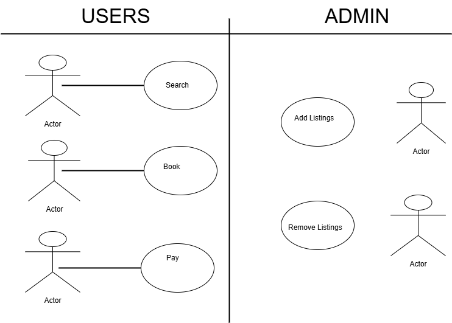

# Requirement Analysis in Software Development

## 📌 Introduction
This repository contains the **Requirement Analysis Project** for a Booking Management System.  
The purpose of this repository is to document, analyze, and structure the software requirements of the system.  
It serves as a blueprint for the development phase, ensuring clarity, completeness, and alignment with business and user goals.

---

## 🎯 Project Goals
- Understand and apply **requirement analysis principles** in the SDLC.  
- Identify and document **functional and non-functional requirements**.  
- Create **visual representations** of system interactions and actors.  
- Define **use cases and acceptance criteria** for project success.  
- Maintain **industry-standard documentation** practices.

## What is Requirement Analysis?

**Requirement Analysis** is a critical phase in the Software Development Life Cycle (SDLC) where the needs and expectations of stakeholders are identified, documented, and analyzed to form a clear blueprint for software development.

### Key Aspects:
- **Gathering Requirements:** Collect information from stakeholders, users, and business analysts to understand what the system must achieve.  
- **Analyzing Requirements:** Examine the collected information to identify conflicts, redundancies, and feasibility issues.  
- **Documenting Requirements:** Record the functional and non-functional requirements in a structured format for developers, testers, and stakeholders.  
- **Validating Requirements:** Ensure that the documented requirements accurately reflect stakeholder expectations and can be implemented within project constraints.

### Importance in SDLC:
- Provides a **clear understanding** of what needs to be built, reducing ambiguity.  
- Helps **prevent scope creep** by defining clear boundaries for the project.  
- Acts as a **reference point** for development, testing, and maintenance.  
- Ensures that the final product meets **business objectives and user needs**, increasing the chances of project success.  

## Why is Requirement Analysis Important?

Requirement Analysis plays a crucial role in the success of any software project. Here are three key reasons why it is critical in the SDLC:

1. **Reduces Ambiguity and Misunderstandings**  
   - Clearly documented requirements ensure that developers, testers, and stakeholders have a **shared understanding** of what needs to be built.  
   - Minimizes the risk of miscommunication and errors during development.

2. **Prevents Scope Creep**  
   - By defining the project boundaries and priorities early, Requirement Analysis helps **control changes** and additions that could derail the project timeline or budget.  

3. **Enhances Project Success and Quality**  
   - Proper requirement analysis ensures the final product **meets user expectations and business goals**.  
   - Facilitates better planning, testing, and risk management, leading to a **higher-quality software system**.  

Additional Benefits:  
- Provides a **foundation for designing and developing the system** efficiently.  
- Helps in **estimating time, cost, and resources** more accurately.  
- Supports **traceability**, allowing stakeholders to track features from requirements to delivery.  

## Key Activities in Requirement Analysis

Requirement Analysis involves a series of structured activities to ensure that software requirements are clear, complete, and feasible. The five key activities are:

- **Requirement Gathering**  
  - Collecting information from stakeholders, users, and existing systems to understand the project’s needs.  
  - Sources include interviews, surveys, observations, and documentation reviews.

- **Requirement Elicitation**  
  - Actively engaging stakeholders to extract requirements through discussions, workshops, and brainstorming sessions.  
  - Focuses on uncovering both explicit and implicit requirements.

- **Requirement Documentation**  
  - Recording requirements in a clear, structured format such as SRS (Software Requirement Specification).  
  - Ensures that requirements are accessible and understandable for all project team members.

- **Requirement Analysis and Modeling**  
  - Examining requirements to identify inconsistencies, conflicts, or gaps.  
  - Creating models and diagrams (e.g., use case diagrams, data flow diagrams) to represent system functionality visually.

- **Requirement Validation**  
  - Reviewing and verifying that the documented requirements accurately reflect stakeholder needs.  
  - Ensures that requirements are feasible, testable, and aligned with project goals.  

## Types of Requirements

Requirements are typically categorized into **Functional** and **Non-Functional** requirements, each serving a distinct purpose in software development.

### Functional Requirements
Functional requirements define **what the system should do**—the features and functions that enable the software to meet user needs.  

**Examples for Booking Management System:**  
- Users can **search for available properties** based on location, date, and price.  
- Users can **view detailed property information** including images, amenities, and reviews.  
- Users can **book a property** and receive a confirmation.  
- Admins can **manage listings**, including adding, updating, and deleting properties.  
- The system supports **user authentication** (login, signup, password reset).  

### Non-Functional Requirements
Non-functional requirements define **how the system performs** and its **quality attributes**.  

**Examples for Booking Management System:**  
- **Performance:** The system must load search results within 3 seconds.  
- **Scalability:** The system should support up to 10,000 concurrent users.  
- **Security:** User data and payment information must be encrypted and comply with standards.  
- **Usability:** The interface should be intuitive and responsive on both desktop and mobile devices.  
- **Reliability:** The system should have 99.9% uptime and proper error handling.  

## Use Case Diagrams

**Use Case Diagrams** are visual representations that show the interactions between **actors** (users or external systems) and the **system** to achieve a goal. They help in understanding **system functionality** from the user’s perspective.

### Benefits of Use Case Diagrams
- Clearly identifies **who interacts with the system** and what actions they can perform.  
- Helps in **requirement validation** and ensures all user scenarios are considered.  
- Supports **communication** between developers, designers, and stakeholders.  
- Provides a **visual overview** of system functionality, useful for planning and documentation.  

### Booking Management System Use Case Diagram
The use case diagram below illustrates key actors and their interactions with the booking system.

**Actors:**  
- **User**: Searches for properties, views details, makes bookings.  
- **Admin**: Manages listings, approves or removes properties.  
- **Payment Gateway**: Processes payments securely.  

**Use Cases:**  
- Search for properties  
- View property details  
- Book a property  
- Manage listings (admin)  
- Process payments  

## Acceptance Criteria

**Acceptance Criteria** are specific conditions that a software feature must meet to be considered complete and acceptable by stakeholders. They provide a **clear definition of done** and ensure that development aligns with user and business expectations.

### Importance of Acceptance Criteria
- **Clarifies expectations** between stakeholders and the development team.  
- **Reduces misunderstandings** about feature functionality.  
- Serves as a **basis for testing** and validation.  
- Helps in **prioritizing tasks** and defining the scope of features.  

### Example: Checkout Feature (Booking Management System)
**Feature:** Secure Checkout for Booking a Property  

**Acceptance Criteria:**  
1. Users must be able to select a property and proceed to checkout.  
2. Users can enter or select payment details securely.  
3. The system validates payment information before processing.  
4. Users receive a confirmation message and booking details after successful payment.  
5. Any errors in payment or required fields are displayed clearly to the user.  
6. The system updates booking records in the database immediately upon successful checkout.  
