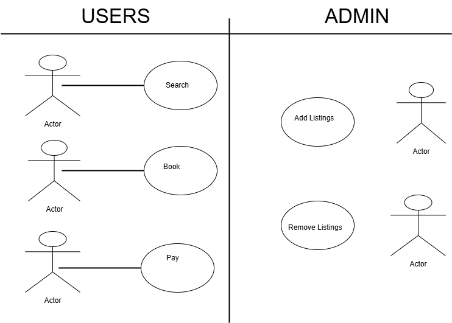

# Requirement-Analysis in Software Development
This repository contains detailed information and examples related to Requirement Analysis in the Software Development Life Cycle (SDLC). It explains what Requirement Analysis is, why it's important, and includes use cases and diagrams to help understand the process better.
## What is Requirement Analysis?

Requirement Analysis is the process of identifying, gathering, and understanding the needs and expectations of stakeholders for a software system. It ensures that developers build the right system that solves the right problem.

This phase is part of the Software Development Life Cycle (SDLC) and involves communication between clients, end-users, and the development team.

### Importance in SDLC:
- Helps define **what** the system should do
- Avoids misunderstandings between users and developers
- Saves time and money by reducing errors early
## Why is Requirement Analysis Important?

Here are 3 key reasons:

1. **Prevents Project Failure**  
   Poor requirements are one of the main reasons software projects fail. Requirement Analysis makes sure everyone is on the same page.

2. **Reduces Development Costs**  
   Catching issues early means less time fixing things later, which saves money.

3. **Improves User Satisfaction**  
   If the final product matches what users want and expect, they’ll be happier and more likely to use it.
## Key Activities in Requirement Analysis

- **Requirement Gathering**  
  Collect information from stakeholders (clients, users, etc.).

- **Requirement Elicitation**  
  Use interviews, surveys, workshops, etc. to draw out the real needs of users.

- **Requirement Documentation**  
  Write everything down clearly so everyone understands the same thing.

- **Requirement Analysis and Modeling**  
  Break down, review, and model requirements using tools (e.g., diagrams).

- **Requirement Validation**  
  Confirm that requirements are correct, complete, and agreed on by all.
## Types of Requirements

### Functional Requirements

These describe **what the system should do**:

- Users should be able to search for available properties.
- Users can book a property using the checkout system.
- Admins can add, edit, or remove property listings.

### Non-functional Requirements

These describe **how the system performs**:

- The site should load within 3 seconds (performance).
- The system should be available 99.9% of the time (reliability).
- All user data must be encrypted (security).
- The system must support mobile devices (usability).
## Use Case Diagrams

Use case diagrams help visualize how users (actors) interact with a system. They show what functions (use cases) each user can perform.

## Acceptance Criteria

Acceptance Criteria are the conditions that must be met for a feature to be considered "done" and acceptable to the client or product owner.

They help ensure that the development team understands exactly what needs to be delivered.

### Example: Checkout Feature – Acceptance Criteria

- The user can add payment details and confirm a booking.
- The system displays a success message after booking.
- Booking details are saved in the database.
- User receives a confirmation email within 1 minute.
